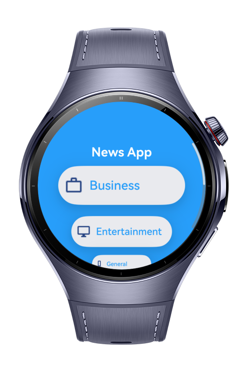

> **Note:** To access all shared projects, get information about environment setup, and view other guides, please visit [Explore-In-HMOS-Wearable Index](https://github.com/Explore-In-HMOS-Wearable/hmos-index).

# News App
A lightweight HarmonyOS ArkTS news reader that browses categorized articles from a mock service. Clean, scrollable UI with simple navigation and smooth transitions. No real backend—everything is simulated.

# Preview
<div>
 
 
 

</div>

# Use Cases
- Browse categories and open related news lists
- Read article details with title, summary, and body
- Navigate back-and-forth with animated transitions

# Tech Stack
- **Languages:** ArkTS (TypeScript)
- **UI:** ArkUI (`@kit.ArkUI`)
- **Tools/IDE:** DevEco Studio **5.1.0**
- **SDK:** HarmonyOS SDK **5.1.0 (18)**
- **Libraries:** Built-in kits only

# Directory Structure
```
entry/
└── ets/
    ├── common/
    │   └── constants/
    │       └── StyleConstants.ets
    ├── component/
    │   └── ListItem.ets
    ├── entryability/
    │   └── EntryAbility.ets
    ├── entrybackupability/
    │   └── EntryBackupAbility.ets
    ├── model/
    │   ├── Article.ets
    │   ├── CategoryResource.ets
    │   ├── NewsResponse.ets
    │   ├── NewsSource.ets
    │   ├── ArticlePageParams.ets
    │   └── NewsPageParams.ets
    ├── pages/
    │   ├── ArticlePage.ets
    │   ├── Index.ets
    │   └── NewsPage.ets
    └── service/
        ├── MockNewsService.ets
        └── NewsService.ets
```

# Constraints and Restrictions

## Supported Device
- Huawei Watch 5

# License
**News App** is distributed under the terms of the MIT License
See the [LICENSE](./LICENSE) for more information.


